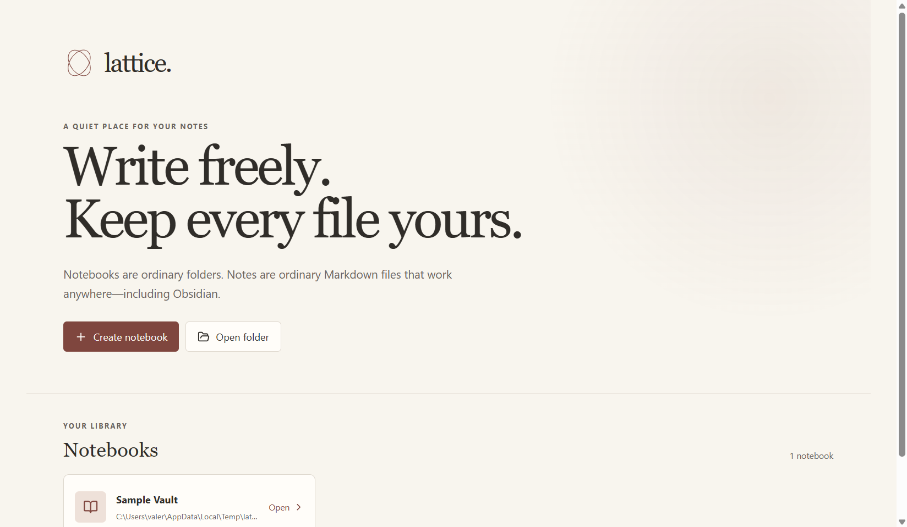
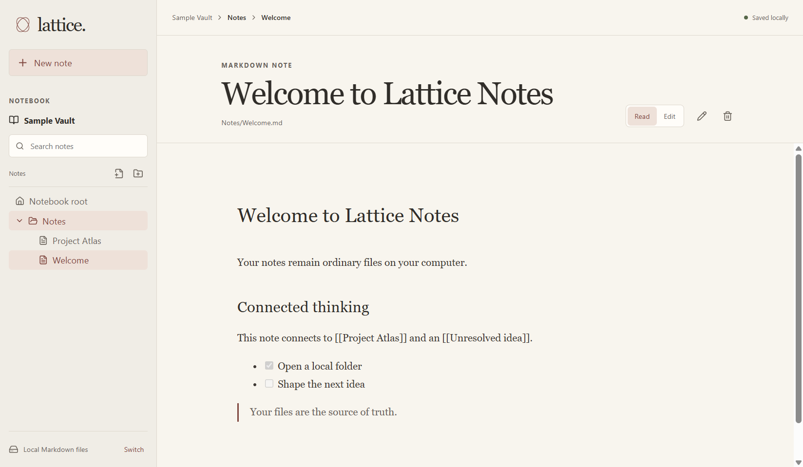

# Lattice Notes

Lattice Notes is a Windows-first, local-first Markdown knowledge workspace with explicit AI context controls. It opens ordinary folders as vaults, keeps `.md` files as the source of truth, and makes every AI file change reviewable and recoverable.





## What works in 0.1.0

- A dedicated Vault Manager with search, recent/name sort, pinning, list/grid views, availability state, paths, File Explorer reveal, and safe unregistering. Removing a vault never deletes its folder.
- Create a new vault under a native-picker parent folder, optionally with Inbox, Notes, Projects, Sources, Attachments, Templates, Archive, and a welcome note. Register any existing folder without moving it.
- Native nested file tree with note/folder creation, rename, duplicate, refresh, and Recycle Bin deletion.
- Atomic autosave with visible status. Disk modification times are checked before writes so external edits produce a conflict instead of a silent overwrite.
- Source editing with CodeMirror and GFM reading mode with headings, task lists, tables, quotes, code, links, and safe local images. Raw HTML is not executed.
- YAML frontmatter surfaced as editable properties for strings, numbers, booleans, dates, and lists/tags. Invalid YAML stays intact and can be repaired in Source mode.
- Wiki links (`[[Note]]`, `[[Note|alias]]`, `[[Note#Heading]]`) and local Markdown note links, backlink excerpts, unresolved links, full-vault search, and an interactive graph with drag/pan/zoom, orphan/unresolved styles, layout pause, node opening, and an accessible list alternative.
- Rename impact detection. Lattice lists referring notes before an optional link update and snapshots each changed file.
- Local and online OpenAI-compatible AI routes, a provider/model library, secure API-key encryption through Electron `safeStorage`, explicit context scope, prominent local/online status, and Ask/Suggest/Edit modes.
- AI output is never written immediately. Suggest/Edit opens a before/after review; apply creates a vault-local snapshot first. Reject and copy are always available.
- Reduced-motion support, strong focus states, semantic controls, keyboard-accessible navigation, and an original Lucide-based dark interface.

## Privacy and trust model

Core note features require no account and no cloud service. Local model requests default to `http://127.0.0.1:1234/v1`. Online requests show an amber disclosure and send only the selected context—never the whole vault by default.

API keys are encrypted using the operating system-backed mechanism exposed by Electron `safeStorage`, then stored in the app profile. Keys are never written into a vault, browser local storage, logs, or source control.

Markdown, links, imported text, and model output are treated as untrusted. Reading mode skips raw HTML and code blocks are displayed, never executed. Filesystem calls resolve and validate every relative path against the active vault root. Significant AI and rename-link changes create copies under `.lattice/history/` before modification.

## AI setup

### Local route (LM Studio or another compatible runtime)

1. Install a runtime that exposes an OpenAI-compatible HTTP server, such as LM Studio.
2. Download a compatible instruct model in that runtime. The in-app catalog lists a small, honest set of GGUF starting points and links to their Hugging Face search pages; Lattice does not imply arbitrary repositories can run directly.
3. Start the local server, typically at `http://127.0.0.1:1234/v1`.
4. In **Model Library → Local runtime → Configure**, enter the server URL and the model identifier shown by your runtime.
5. Open a note, choose Local processing, choose the context scope, and run Ask/Suggest/Edit.

Model downloads, process lifecycle, progress, removal, and updates remain the responsibility of the local runtime in 0.1.0. Lattice shows curated format, approximate size, memory guidance, publisher, license, and source links, but does not yet manage model binaries itself.

### Online OpenAI-compatible route

1. Open **Model Library → OpenAI-compatible → Configure**.
2. Set the base URL and model identifier.
3. Enter the API key. It is encrypted with OS-backed secure storage.
4. Before sending, verify the amber disclosure and context selector.

Google Gemini can be used only through an OpenAI-compatible gateway in this release; a native Gemini adapter is planned.

## Markdown and links

Lattice indexes `.md` and `.markdown` recursively and ignores its private `.lattice` recovery directory. Wiki-link resolution matches titles, basenames, and vault-relative note paths case-insensitively. Heading and alias syntax is parsed; global graph edges currently resolve most reliably by note title or basename. External HTTP links remain ordinary rendered links. Remote images are not fetched by Lattice itself; Chromium may request a remote URL when a note explicitly embeds one.

## Development

Requirements: Windows 10/11, Node.js 20 or newer, and npm.

```powershell
npm install
npm run dev
```

Quality checks:

```powershell
npm run format:check
npm run lint
npm test
npm run build
npm run smoke
```

The smoke test launches the production Electron bundle with an isolated temporary app profile and sample vault. It verifies the Vault Manager, local note reading, indexing, graph rendering, and captures the README screenshots in `artifacts/`.

## Windows packaging

```powershell
npm run package:win
```

Artifacts are written to `release/`. The configured build targets are an interactive NSIS installer and a portable `.exe`. If Windows executable post-processing is blocked, `release/win-unpacked/Lattice Notes.exe` plus its sibling files is the verified fallback and can be distributed as the generated `Lattice-Notes-0.1.0-Windows-x64.zip`.

## Architecture

- `electron/main.ts`: native window, dialogs, vault registry, filesystem operations, watcher, secure secrets, snapshots, and provider HTTP transport.
- `electron/preload.ts`: narrow context-isolated IPC bridge; the renderer has no Node access.
- `electron/safety.ts`: vault boundary and Windows filename rules.
- `src/core/markdown.ts`: frontmatter, links, indexing, and edit primitives with focused tests.
- `src/App.tsx`: Vault Manager, workspace, Markdown surfaces, search, graph, provider library, AI review, settings, and recovery UI.
- `design-system/lattice-notes/MASTER.md`: persisted visual contract generated before UI implementation.

## Known first-release limits

- File-tree drag reordering, tab dragging/pinning, a visual history restore browser, and a three-way merge UI are not yet implemented. Conflicts preserve the draft and offer a disk reload path.
- Search rebuilds the in-memory index after relevant operations rather than using a durable background database; very large vaults may refresh slowly.
- Graph filters and local-depth controls are present at the UI level, but local-graph traversal is basic and global graph is the primary tested path.
- Direct Hugging Face download/runtime management is intentionally delegated to a compatible local runtime.
- AI selection context falls back to an explicit “no selection provided” marker; selection extraction from CodeMirror is not yet wired.
- Conversation history is intentionally off and is not persisted in 0.1.0.
- Windows code signing is not included. SmartScreen may warn on an unsigned community build.

## Security notes

Do not expose a local model server to untrusted networks. Review provider URLs before entering a key. Treat model responses as drafts. Keep backups for important vaults; snapshots supplement backups but are not a replacement for them.

Lattice Notes is an original project and does not copy Obsidian source, branding, logos, or bundled assets.

## License

MIT
